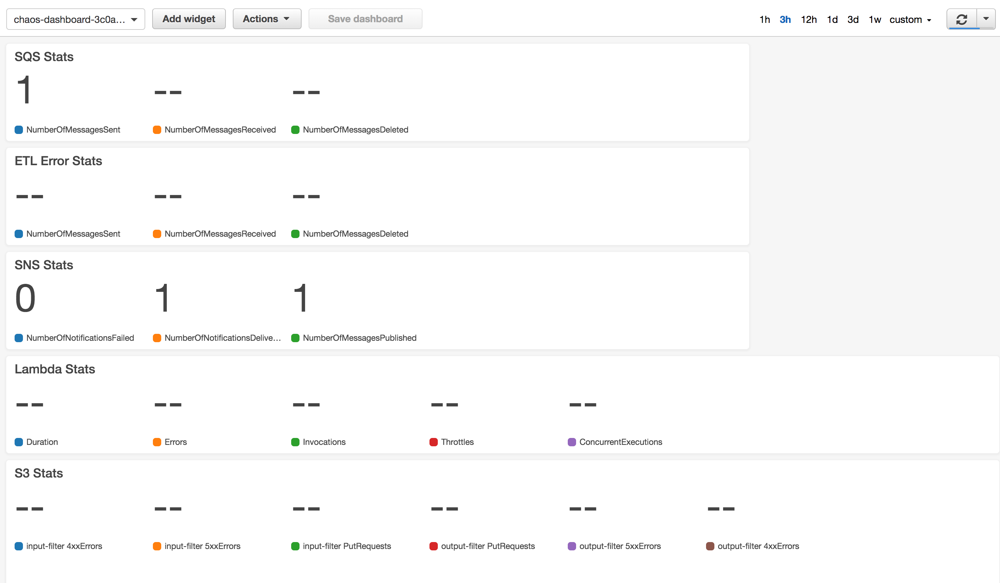

# Lab 1: Build a serverless ETL pipeline

## Overview

In this lab you will use infrastructure-as-code tooling to deploy a serverless ETL pipeline into AWS.  This pipeline is designed to accept JSON documents and convert them to CSV.  The infrastructure-as-code will create a metrics dashboard which you can use to monitor the pipeline's performance.  To test the pipeline and its dashboard you will execute drivers to push traffic through the pipeline.

## Objectives
 - Observe the architecture and assess the applications steady state
 - Review the custom code in the AWS Lambda function
 - Determine the service level objectives you will use to measure your steady state

 ---

 ## Create the pipeline

 **Step-by-step**
 1. Using the Terraform cli, deploy the architecture

    ```bash
    $ cd terraform
    $ terraform init
    $ terraform apply .
    ```

 1. Visit the dashboard for the ETL pipeline using the [AWS CloudWatch Console](https://console.aws.amazon.com/cloudwatch/home?#dashboards:).  Look for and open the dashboard with a name such as `chaos-dashboard-3c0ad6c72e1a1234`.

     

 1. Review the ETL Lambda function via the [AWS Lambda console](https://console.aws.amazon.com/lambda/home?#/functions).

 1. To begin sending files through the pipeline execute the two driver programs provided for you in the `drivers` directory:

     ```bash
     $ cd ../drivers
     $ ./the_publisher &
     $ ./the_subscriber &
     ``` 
## Steady State

Files are now being sent to Amazon S3, the entry point of your ETL pipeline.  Upon landing in the S3 bucket the ETL Lambda function is being triggered to parse the received file, convert it to CSV, and write the CSV file back into the S3 bucket.  When the CSV file lands in S3 the Amazon S3 service sends a notification to an SNS topic which has an SQS queue subscribed to the topic.  

When a file is encountered by the ETL Lambda function which it cannot parse it will experience an exception.  S3 will invoke the Lambda function 2 more times in an effort to parse the file, if all 3 invocations experience an error the message will be stored into the dead letter queue configured for the Lambda function.

A metrics dashboard has been created for the various components of the ETL pipeline which will show stats aggregated over a 5 minute period.  During normal operation you will see messages flowing into and out of the SQS queue under SQS stats.  Any messages that couldn't be procssed by the Lambda function will be captured under ETL Error stats.  You will also see statistics for the SNS topic and the Lambda function.  The drivers simulate JSON files with 1 in every 100 having a syntax error.  As such, during normal operation, the number of messages int he ETL Error Stats queue, divided by the number of messages received from the SQS stats should be around 1%.  If this number were to rise it would indicate an error in the expected steady state of the application.  We will use this to define the service level objective and hence the steady state of the ETL pipeline: it will process files with no more than 1 out of every 100 messages requiring human intervention.

## ETL Lambda code

If you would like to inspect the Lambda function's configuration you can view the definition in the [AWS Lambda console]().  Look for the function named something like `ChaosTransformer-acb931ee86e41234`.  Take note of attributes such as the function's timeout setting, and its asynchronous invocation configuration.

If you would like to review the code you can see it in the `src` directory of this repository.
